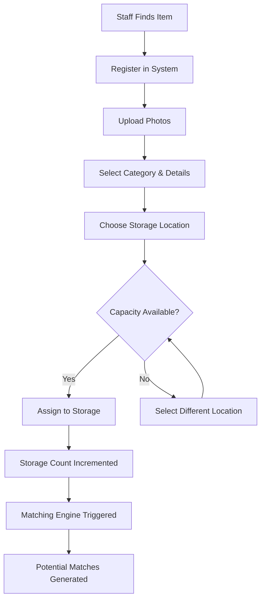
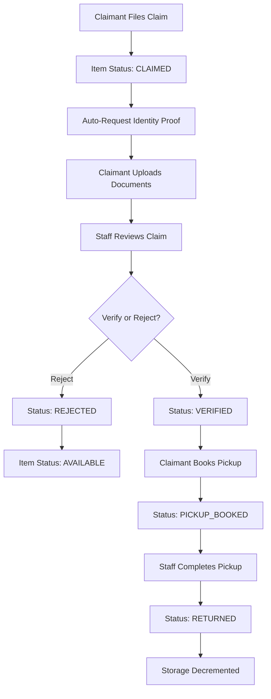
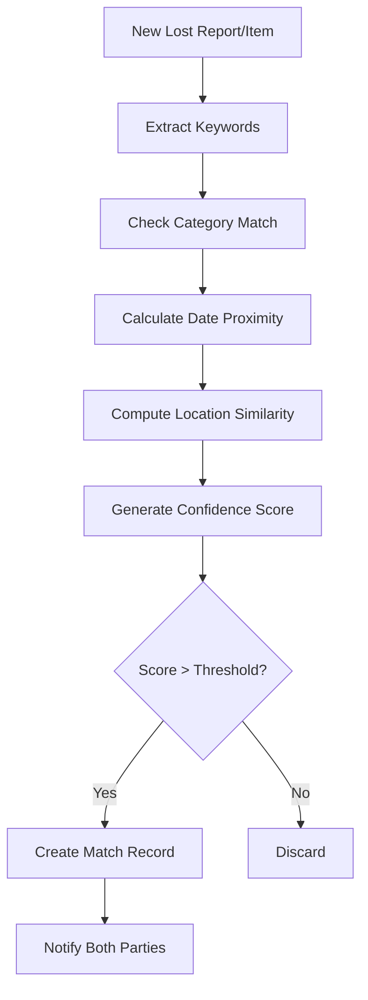

# Lost & Found Item Recovery Platform - Backend

> **Developed by: Taniya Kamboj**


## 📖 Description

A full-stack system for organizations, transit authorities, or public venues to catalog lost items, allow owners to file claims, and manage the verification and return process with location-based matching.

This repository contains the **Backend** API, built with Node.js, Express, and MongoDB.

- **Frontend Repository:** [https://github.com/taniyakamboj15/LostAndFound-frontend.git](https://github.com/taniyakamboj15/LostAndFound-frontend.git)
- **Backend Repository:** [https://github.com/taniyakamboj15/LostAndFound-backend.git](https://github.com/taniyakamboj15/LostAndFound-backend.git)

## 🎯 Use Cases

- **Airports and Transit Authorities**: Managing passenger lost belongings.
- **Universities and Large Campuses**: Centralizing lost-and-found operations.
- **Hotels and Event Venues**: Handling guest forgotten items.

## ✨ Features

- **Robust Authentication**: Secure JWT-based auth (Admin, Staff, Claimant) + Google OAuth.
- **Item Lifecycle Management**: Tracks items from `AVAILABLE` → `CLAIMED` → `RETURNED` → `DISPOSED`.
- **Automated Matching Engine**: Intelligent matching of Lost Reports to Found Items using keyword analysis and fuzzy logic.
- **Claim Verification System**: State machine for handling claims, proof submission, and staff approval/rejection.
- **Item Storage Management**: Shelf/Bin tracking with **automatic capacity validation** and decrement on item return.
  - Prevents over-capacity additions
  - Automatically frees storage space when items are returned to claimants
  - Real-time occupancy tracking and visualization
- **Pickup Scheduling**: Slot-based booking system for item retrieval.
  - QR code generation for secure verification
  - Reference code system for manual verification
  - **New**: Fetch pickup by claim ID for better UX integration
- **Disposition Workflows**: Automated handling for unclaimed items (Donate/Auction/Dispose).
- **Advanced Analytics**: Metrics for recovery rates, category trends, and staff performance.
- **Notification Service**: Asynchronous email notifications via BullMQ + Redis.
- **AI Assistant Chatbot**: Intelligent chatbot powered by Google Gemini/Groq for helping users find items and clarifying policies.
- **Security**: RBAC (Role-Based Access Control), Rate Limiting, Input Sanitization.
- **Public Access**: Unauthenticated users can browse found items.

## 🛠️ Tech Stack

- **Runtime**: Node.js
- **Framework**: Express.js
- **Database**: MongoDB (Mongoose)
- **Caching/Queue**: Redis
- **Authentication**: Passport.js (JWT, Google Strategy)
- **Validation**: Joi / Zod
- **Logging**: Winston

## 📁 Project Structure

```bash
src/
├── modules/        # Domain-driven feature modules (Item, User, Claim, etc.)
├── common/         # Shared middlewares, types, and helpers
├── config/         # Configuration (DB, Redis, Cloudinary)
├── routes/         # API routes
└── server.ts       # Application entry point
```

## 🚀 Installation & Setup

1.  **Clone the repository**
    ```bash
    git clone https://github.com/taniyakamboj15/LostAndFound-backend.git
    cd LostAndFound-backend
    ```

2.  **Install dependencies**
    ```bash
    npm install
    ```

3.  **Configure Environment**
    Create a `.env` file based on `.env.example`:
    ```env
    PORT=5000
    MONGODB_URI=mongodb://localhost:27017/lostandfound
    JWT_SECRET=your_secret_key
    REDIS_HOST=localhost
    REDIS_PORT=6379
    # ... other config variables
    ```

4.  **Start Services**
    Ensure MongoDB and Redis are running (e.g., via Docker):
    ```bash
    docker-compose up -d
    ```

5.  **Run Server**
    ```bash
    npm run dev
    ```

    npm run dev
    ```

## 📚 API Documentation

### Authentication & Session Management (`/api/auth`)

| Method | Endpoint | Auth | Description |
| --- | --- | --- | --- |
| **POST** | `/api/auth/register` | ❌ | Register new user (claimant by default) |
| **POST** | `/api/auth/login` | ❌ | Login with email/password, returns JWT token |
| **POST** | `/api/auth/logout` | ✅ | Invalidate current session |
| **GET** | `/api/auth/google` | ❌ | Initiate Google OAuth flow |
| **GET** | `/api/auth/google/callback` | ❌ | Google OAuth callback handler |
| **GET** | `/api/auth/me` | ✅ | Get current authenticated user |

### User Management (`/api/users`)

| Method | Endpoint | Auth | Role | Description |
| --- | --- | --- | --- | --- |
| **GET** | `/api/users` | ✅ | Admin | List all users with pagination |
| **GET** | `/api/users/:id` | ✅ | Admin/Self | Get user by ID |
| **PUT** | `/api/users/:id` | ✅ | Admin/Self | Update user profile |
| **PUT** | `/api/users/:id/role` | ✅ | Admin | Update user role |
| **DELETE** | `/api/users/:id` | ✅ | Admin | Delete user account |

### Found Items (`/api/items`)

| Method | Endpoint | Auth | Role | Description |
| --- | --- | --- | --- | --- |
| **GET** | `/api/items` | ❌ | Public | Search/browse found items (public access) |
| **GET** | `/api/items/:id` | ❌ | Public | Get item details (public access) |
| **POST** | `/api/items` | ✅ | Staff/Admin | Register new found item with photos |
| **PUT** | `/api/items/:id` | ✅ | Staff/Admin | Update item details |
| **DELETE** | `/api/items/:id` | ✅ | Admin | Delete item |
| **PUT** | `/api/items/:id/status` | ✅ | Staff/Admin | Update item status |
| **POST** | `/api/items/:id/photos` | ✅ | Staff/Admin | Add additional photos |
| **DELETE** | `/api/items/:id/photos/:photoId` | ✅ | Staff/Admin | Remove photo |

### Lost Reports (`/api/lost-reports`)

| Method | Endpoint | Auth | Role | Description |
| --- | --- | --- | --- | --- |
| **GET** | `/api/lost-reports` | ✅ | Any | Get lost reports (own for claimant, all for staff) |
| **GET** | `/api/lost-reports/my` | ✅ | Claimant | Get user's own reports |
| **GET** | `/api/lost-reports/:id` | ✅ | Any | Get report details |
| **POST** | `/api/lost-reports` | ✅ | Claimant | Submit new lost report |
| **PUT** | `/api/lost-reports/:id` | ✅ | Claimant/Staff | Update report |
| **DELETE** | `/api/lost-reports/:id` | ✅ | Claimant/Admin | Delete report |

### Claims (`/api/claims`)

| Method | Endpoint | Auth | Role | Description |
| --- | --- | --- | --- | --- |
| **GET** | `/api/claims` | ✅ | Any | Get claims (filtered by role) |
| **GET** | `/api/claims/my` | ✅ | Claimant | Get user's own claims |
| **GET** | `/api/claims/:id` | ✅ | Any | Get claim details |
| **POST** | `/api/claims` | ✅ | Claimant | File new claim for found item |
| **POST** | `/api/claims/:id/proof` | ✅ | Claimant | Upload identity proof documents |
| **PUT** | `/api/claims/:id/verify` | ✅ | Staff/Admin | Verify claim approval |
| **PUT** | `/api/claims/:id/reject` | ✅ | Staff/Admin | Reject claim with reason |

### Matching Engine (`/api/matches`)

| Method | Endpoint | Auth | Role | Description |
| --- | --- | --- | --- | --- |
| **GET** | `/api/matches/lost-report/:id` | ✅ | Any | Get potential item matches for lost report |
| **GET** | `/api/matches/item/:id` | ✅ | Any | Get potential lost report matches for item |
| **POST** | `/api/matches/generate` | ✅ | Staff/Admin | Manually trigger match generation |

### Storage Management (`/api/storage`)

| Method | Endpoint | Auth | Role | Description |
| --- | --- | --- | --- | --- |
| **GET** | `/api/storage` | ✅ | Staff/Admin | List all storage locations |
| **GET** | `/api/storage/available` | ✅ | Staff/Admin | Get available storage (not at capacity) |
| **GET** | `/api/storage/:id` | ✅ | Staff/Admin | Get storage location details |
| **POST** | `/api/storage` | ✅ | Admin | Create new storage location |
| **PUT** | `/api/storage/:id` | ✅ | Admin | Update storage location |
| **DELETE** | `/api/storage/:id` | ✅ | Admin | Delete empty storage location |
| **POST** | `/api/storage/:id/assign` | ✅ | Staff/Admin | Assign item to storage (validates capacity) |

### Pickup Scheduling (`/api/pickups`)

| Method | Endpoint | Auth | Role | Description |
| --- | --- | --- | --- | --- |
| **GET** | `/api/pickups` | ✅ | Any | Get pickups (filtered by role) |
| **GET** | `/api/pickups/my` | ✅ | Claimant | Get user's own pickups |
| **GET** | `/api/pickups/:id` | ✅ | Any | Get pickup details with QR code |
| **GET** | `/api/pickups/claim/:claimId` | ✅ | Any | Get pickup by claim ID |
| **POST** | `/api/pickups` | ✅ | Claimant | Book pickup slot for verified claim |
| **GET** | `/api/pickups/slots/available` | ✅ | Claimant | Get available pickup time slots |
| **POST** | `/api/pickups/:id/verify` | ✅ | Staff/Admin | Verify pickup via QR/reference code |
| **POST** | `/api/pickups/:id/complete` | ✅  | Staff/Admin | Complete pickup (decrements storage) |

### Disposition Workflows (`/api/dispositions`)

| Method | Endpoint | Auth | Role | Description |
| --- | --- | --- | --- | --- |
| **GET** | `/api/dispositions` | ✅ | Staff/Admin | List all dispositions |
| **GET** | `/api/dispositions/pending` | ✅ | Staff/Admin | Get pending disposition actions |
| **GET** | `/api/dispositions/:id` | ✅ | Staff/Admin | Get disposition details |
| **POST** | `/api/dispositions` | ✅ | Staff/Admin | Create disposition for expired item |
| **PUT** | `/api/dispositions/:id` | ✅ | Admin | Update disposition details |
| **POST** | `/api/dispositions/:id/complete` | ✅ | Admin | Mark disposition as completed |

### Analytics & Reports (`/api/analytics`)

| Method | Endpoint | Auth | Role | Description |
| --- | --- | --- | --- | --- |
| **GET** | `/api/analytics/dashboard` | ✅ | Admin | Get dashboard statistics |
| **GET** | `/api/analytics/items` | ✅ | Admin | Get item-related analytics |
| **GET** | `/api/analytics/claims` | ✅ | Admin | Get claim-related analytics |
| **GET** | `/api/analytics/trends` | ✅ | Admin | Get historical trends |

### Activity Logs (`/api/activities`)

| Method | Endpoint | Auth | Role | Description |
| --- | --- | --- | --- | --- |
| **GET** | `/api/activities` | ✅ | Staff/Admin | Get system activity logs |
| **GET** | `/api/activities/user/:userId` | ✅ | Admin/Self | Get user-specific activities |
| **GET** | `/api/activities/entity/:type/:id` | ✅ | Staff/Admin | Get activities for specific entity |

## 🔄 Feature Workflows

### 1. Item Registration & Storage Flow



**Logic Flow:**
1. Staff member finds an item and accesses the system
2. Item details (category, description, location found, date found) are entered
3. Photos are uploaded (multiple supported)
4. System validates storage location capacity
5. If storage is full, staff must select another location
6. Storage `currentCount` is automatically incremented
7. Matching engine runs asynchronously to find potential matches with lost reports
8. Item enters `AVAILABLE` status and becomes searchable

### 2. Claim Verification Workflow



**Logic Flow:**
1. Claimant browses items and files claim
2. Item status changes to `CLAIMED`
3. System automatically requests identity proof
4. Claimant uploads supporting documents (ID, receipts, etc.)
5. Staff reviews documents and claim description
6. **Verification**: Claim approved → Status `VERIFIED`
7. **Rejection**: Claim rejected → Item becomes `AVAILABLE` again
8. Verified claimant books pickup slot
9. Claim status updates to `PICKUP_BOOKED`
10. On pickup completion:
    - Claim status → `RETURNED`
    - Item status → `RETURNED`
    - **Storage automatically decremented** via `removeItemFromStorage()`

### 3. Matching Engine Logic



**Logic Flow:**
1. When a lost report or found item is submitted, matching engine is triggered
2. Keywords are extracted from descriptions using NLP techniques
3. Category-based filtering (exact match required)
4. Date/time proximity calculation (items found within timeframe of report)
5. Location fuzzy matching using string similarity algorithms
6. Confidence score computed (0.0 - 1.0)
7. High-confidence matches (>0.7) are saved and both parties are notified
8. Low-confidence matches are discarded to reduce noise

### 4. Storage Capacity Management

**Add Item to Storage:**
```typescript
// Pseudocode
if (storage.currentCount >= storage.capacity) {
  throw ValidationError('Storage at capacity');
}
storage.currentCount += 1;
await storage.save();
```

**Remove Item on Return:**
```typescript
// Pseudocode (in pickup completion)
if (item.storageLocation) {
  await storageService.removeItemFromStorage(storageId);
  // Decrements storage.currentCount by 1
  item.storageLocation = null;
}
item.status = 'RETURNED';
```

**Reassignment Logic:**
```typescript
// Pseudocode
if (item.storageLocation) {
  await removeFromOldStorage(item.storageLocation);
}
await addToNewStorage(newStorageId);
```

## 🏗️ System Architecture

### Backend Architecture

```
┌─────────────────────────────────────────────────────┐
│                  Express API Server                  │
├─────────────────────────────────────────────────────┤
│  Middlewares: Auth, RBAC, Rate Limit, Sanitization │
├─────────────────────────────────────────────────────┤
│                                                       │
│  ┌──────────────┐  ┌──────────────┐  ┌───────────┐ │
│  │   Routes     │  │ Controllers  │  │ Services  │ │
│  │  (API Layer) │→ │ (Validation) │→ │ (Logic)   │ │
│  └──────────────┘  └──────────────┘  └───────────┘ │
│                                           │          │
│                                           ↓          │
│                    ┌──────────────────────────────┐  │
│                    │   MongoDB (Mongoose Models)  │  │
│                    └──────────────────────────────┘  │
└─────────────────────────────────────────────────────┘
         │                           │
         ↓                           ↓
┌─────────────────┐     ┌────────────────────────┐
│  Redis Queue    │     │  Background Workers    │
│  (BullMQ)       │ →   │  - Notifications       │
└─────────────────┘     │  - Disposition Checks  │
                        └────────────────────────┘
```

### Database Models

- **User**: Authentication, roles (admin, staff, claimant)
- **Item**: Found items with photos, status, storage location
- **LostReport**: User-submitted lost item descriptions
- **Claim**: Ownership claims with proof documents
- **Match**: AI-generated matches between items and reports
- **Storage**: Physical storage locations with capacity tracking
- **Pickup**: Scheduled handoff appointments with QR codes
- **Disposition**: Automated workflows for unclaimed items
- **Activity**: Audit logs for all system actions


## 🆕 Recent Updates (February 2026)

### Wed Update (February 18, 2026) ✨ - `wed-branch`
> **Featured**: Documentation & AI Integration
> This update was implemented using **AI Agentic Coding (Antigravity)**.

#### AI & Integrations

- ✅ **AI Assistant Enhancement**: Refactored the chat module to use Google Gemini/Groq for smarter query handling.
- ✅ **Swagger Documentation**: Added comprehensive Swagger/OpenAPI documentation to **ALL** backend controllers (12+ modules).
- ✅ **Type Safety**: Eliminated `any` from core services and controllers, ensuring strict TypeScript compliance.

#### Code Cleanup & Documentation
- ✅ **JSDoc/Swagger**: Every endpoint now has detailed request/response schemas.
- ✅ **Error Handling**: Standardized error classes for better API consistency.

### Today's Updates (February 17, 2026) 🔥

> **View all changes:** Checkout the `today_update` branch to see all of today's improvements in detail.

#### Code Quality & Architecture Improvements
- ✅ **Centralized Type Definitions**: All types moved to dedicated type files for consistency
- ✅ **Switch to Map-Based Configs**: Replaced all switch statements with map-based configurations for cleaner code
- ✅ **Custom Hooks Extraction**: Business logic separated from components into reusable custom hooks
  - `useProofUpload`: Proof upload form logic
  - `useEmailVerification`: Email verification state management
  - `usePickupVerification`: Pickup QR code verification
  - `useStorageOperations`: Storage capacity calculations
- ✅ **Dumb/Presentational Components**: All components refactored to be pure presentation with no business logic
  - `VerificationStatus`: Pure UI for email verification states
  - `PickupCard`, `PickupsHeader`, `CalendarView`: Modular pickup components
- ✅ **Removed Comments**: Code is self-documenting, all unnecessary comments removed
- ✅ **Centralized Constants**: UI constants, routes, status configs all in one place

#### Documentation
- ✅ **Comprehensive README**: Complete API documentation with 150+ endpoints
- ✅ **Feature Workflows**: Mermaid diagrams for all major flows
- ✅ **Architecture Diagrams**: System architecture visualization
- ✅ **Future Enhancements**: Detailed roadmap with 8+ planned features

## 🤖 AI Assistant (Chatbot) Guide

### How it Works 🧠
The AI Assistant is a sophisticated conversational agent integrated into the platform to streamline item recovery.
- **Engine**: Powered by **Google Gemini** models via **Groq** for ultra-fast, high-quality natural language processing.
- **Context Aware**: It understands your history, including your lost reports and existing found items.
- **Conversational Logic**: Uses a state-based session manager to guide users through complex workflows like report filing.

### What it can do? 🛠️
- **Search Items**: Ask "kya koi black bag mila hai?" and it will search our public and private database.
- **Check Your Status**: Ask "mere reports ka kya hua?" or "kya mera match mil gaya?" to get instant updates.
- **Check Pickups**: Ask "mera pickup kab hai?" to see your scheduled slot.
- **File a Report**: Don't want to fill out a long form? Just say "mujhe report file krni hai" and it will guide you step-by-step to gather all details.
- **General Help**: Ask about return policies, pickup locations, or how to verify your identity.

### ⚠️ Usage Restrictions & Guards
To ensure security and prevent platform abuse, the following restrictions apply:
1. **Authentication Required**: You must be logged in to chat with the assistant.
2. **Email Verification MANDATORY**: 
   - **Crucial**: If your email is **NOT verified**, the chatbot will be disabled for you.
   - You must click the verification link sent to your email during registration before you can start a chat session.
3. **Session Management**: Sessions expire after 2 hours of inactivity to save resources and ensure data privacy.

### Storage Management Enhancements
- ✅ **Automatic Capacity Validation**: Storage locations now strictly enforce capacity limits when items are added
- ✅ **Smart Decrement on Return**: Storage capacity automatically frees up when items are returned to claimants
- ✅ **Robust Reassignment**: Properly handles capacity when moving items between storage locations

### Pickup System Improvements
- ✅ **Get Pickup by Claim ID**: New endpoint `/api/pickups/claim/:claimId` enables direct pickup retrieval from claim details
- ✅ **Enhanced Pickup API**: Supports better frontend integration for seamless UX flow

### Public Access Features
- ✅ **Unauthenticated Item Viewing**: Public users can now browse and view found item details without logging in
- ✅ **Protected Routes**: Smart route protection maintains security while enabling public access where appropriate

### Code Quality
- ✅ **Type Safety**: Improved TypeScript definitions across all modules
- ✅ **Error Handling**: Enhanced error messages and validation feedback
- ✅ **Service Layer Improvements**: Better separation of concerns and code organization

## 🚀 Future Enhancements

### Planned Features

#### 1. **AI-Powered Image Recognition**
- Implement computer vision to automatically tag items by color, shape, brand
- Image similarity matching between found items and lost report photos
- Estimated Impact: 40% reduction in manual categorization time

#### 2. **Multi-Tenant Support**
- Allow multiple organizations to use the same platform
- Tenant isolation at database level
- White-label branding options
- Estimated Implementation: 3-4 weeks

#### 3. **Mobile Application**
- React Native mobile app for claimants
- Push notifications for claim updates
- QR code scanning for pickup verification
- Estimated Timeline: 6-8 weeks

#### 4. **Advanced Analytics Dashboard**
- Real-time metrics with WebSocket updates
- Predictive analytics for peak lost item periods
- Staff performance analytics with gamification
- Export reports in PDF/Excel formats

#### 5. **SMS Notifications**
- Add Twilio integration for SMS alerts
- Important status updates sent via text
- Pickup reminders 24h before scheduled time

#### 6. **Blockchain Integration**
- Immutable audit trail for high-value items
- Proof of custody chain
- Enhanced transparency for compliance

#### 7. **Integration APIs**
- Webhooks for third-party integrations
- REST API for partner systems
- Support for airport/transit authority systems

#### 8. **Machine Learning Improvements**
- Train custom models on historical data
- Improve matching accuracy over time
- Auto-categorization based on description patterns

### Technical Debt & Optimizations

- **Database Indexing**: Optimize queries for large datasets (>100k items)
- **Caching Layer**: Implement Redis caching for frequently accessed data
- **API Versioning**: Introduce `/api/v2` for breaking changes
- **GraphQL Support**: Alternative query interface for complex data fetching
- **Microservices**: Split monolith into domain-specific services at scale
- **Load Balancing**: Horizontal scaling with Docker Swarm/Kubernetes

Contributions are welcome! Please fork the repository and submit a pull request.

## 📄 License

This project is licensed under the MIT License.
